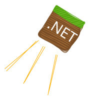
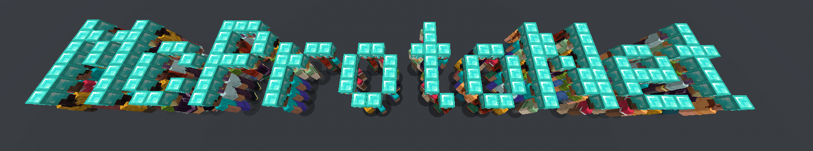

<h1 align="center">
     
  <br>
  <a href="https://www.nuget.org/packages/McProtoNet">
    
  </a>
  <a href="https://f.feedz.io/mcprotonet/night/nuget/index.json">
    
  </a>
</h1>

**McProtoNet** is a .NET library for the Minecraft Java Edition protocol, client side.
It gives you the transport, the packets, and a simple client. You write the bot.



*117 bots join a server, listen to game chat, and walk into any text you type.
This is [examples/FormationBots](examples/FormationBots) — a few hundred lines on top of the library.*

> ⚠️ McProtoNet is under active development. The API changes between versions,
> and not all packets are modeled yet.

## What is inside

- **Transport.** `MinecraftConnection` frames packets over any duplex `Stream`
  on `System.IO.Pipelines`. Compression is [libdeflate], encryption is AES/CFB8
  with hardware cores for x86 (AES-NI) and ARM64 (NEON). The cipher beats
  BouncyCastle by about 2x in our [benchmarks](benchmarks) and allocates nothing per call.
- **Packets.** Typed packet classes for protocols 735–772 (Minecraft 1.16 → 1.21.8),
  generated from [F# specs](https://github.com/Titlehhhh/minecraft-protocol-fs).
  One allocation per packet, no reflection, no boxing on the hot path.
  Unknown packets stay available as raw id + bytes.
- **Client.** `MinecraftClient` connects over TCP and moves packets.
  Handshake, login, and game logic stay in your code — the
  [examples](examples) show the whole path.
- **NBT.** A standalone reader and writer for the NBT format.
- Works with offline-mode servers. Mojang authentication is not implemented yet.

## Quick start

```csharp
var client = new MinecraftClient(new MinecraftClientOptions { Host = "localhost" });
await client.ConnectAsync();

await client.SendAsync(new SetProtocolPacket(772, "localhost", 25565, 2), 772);
await client.SendAsync(new LoginStartPacket("Steve", V764_Last: new(Guid.NewGuid())), 772);

await foreach (var packet in client.ReadPacketsAsync())
{
    // dispatch with the generated handler base, reply with typed SendAsync
}
```

The receive loop and the phase machine live in your code on purpose.
[examples/MinimalBot](examples/MinimalBot) walks the full path in one file:
handshake → login → configuration → play, with keep-alives and chat.
[examples/FormationBots](examples/FormationBots) runs 117 such clients at once —
the whole swarm uses about 80 MB of memory.

## Versions

| | |
| --- | --- |
| Minecraft | 1.16 → 1.21.8 (protocols 735–772) |
| Runtime | .NET 8, .NET 9, .NET 10 |

## 💸 Support the project

You can support development by donating cryptocurrency:

**USDT (TON)**: `UQB5OyxViBHENXXKPpIZdAXJmrmmqn599_aNkYeRe9HqXY4Q`

**USDT (TRC20)**: `TKbnv1CkfQs1UBSoJVbwuqPAhaHDiy7Vbm`

**BTC**: `bc1qgx4glhjhjyw7sz2qt5mhyg40cspgp8lanpl282`

**ETH**: `0xc657D636f22701E0B4D20B098DFd123450D89518`

[libdeflate]: https://github.com/ebiggers/libdeflate
