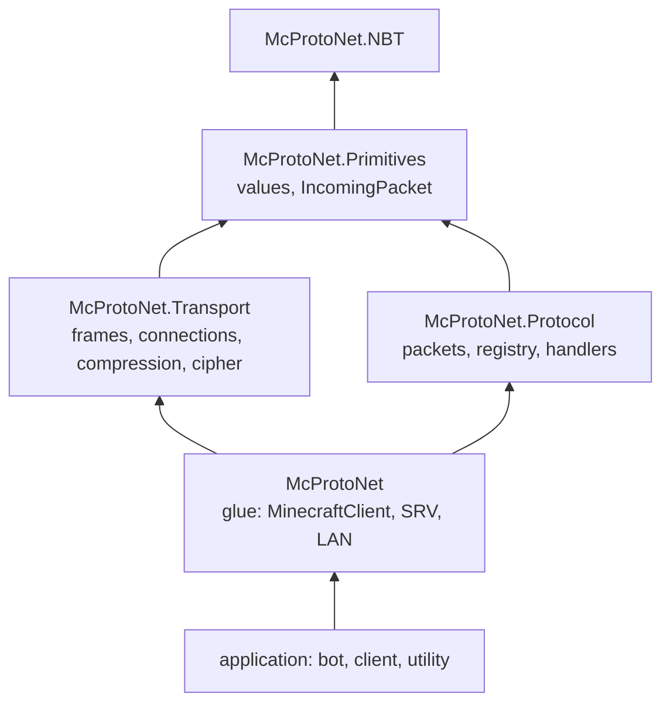

# Who knows whom

The links between layers are one-way and short.

Read the arrow as "references".

Transport and the packet layer sit side by side and know nothing of each other.
Both rely on Primitives. Glue references both, and the application references
glue.

## Why this separation

Transport stays useful without generated packets. Proxies, sniffers, and custom
protocol experiments need frames, compression, and encryption, but not the
decoding of specific packets.

The packet layer, in turn, works without a network. It receives an
[`IncomingPacket`](../08-api-reference/McProtoNet/Primitives/IncomingPacket.md)
as input, and the source does not matter - a socket, a file, a test. This is why
packets and their per-version layouts are checked with round-trip tests, without
a server.

## One non-obvious result

Typed sending (`SendAsync<T>`) lives in glue, not next to the packets. Otherwise
the packet layer would have to see transport, and the separation would break.

## A handler is not a visitor

The packet layer offers two ways to decode an incoming packet: the
[`PacketFlow`](../08-api-reference/McProtoNet/Protocol/PacketFlow.md) visitor
(synchronous `Visit<T>`) and the
[`ClientboundHandler`](../08-api-reference/McProtoNet/Protocol/ClientboundHandler.md)
/
[`ServerboundHandler`](../08-api-reference/McProtoNet/Protocol/ServerboundHandler.md)
handler (asynchronous `On<Name>`, returning `ValueTask`). Why these are separate
paths, not one built on top of the other, is covered in
[Handlers and unknown packets](../05-packets/04-handlers.md).
