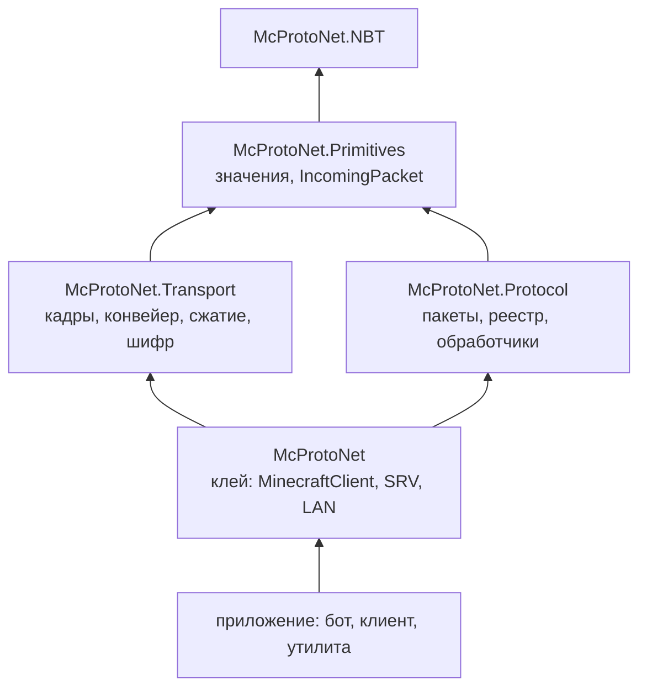

# Кто кого знает

Связи между слоями односторонние и короткие.

Стрелка читается как «ссылается на».

Транспорт и пакетный слой стоят рядом и друг о друге не знают. Оба опираются
на примитивы. Клей ссылается на оба, приложение - на клей.

## Зачем такая развязка

Транспорт остаётся полезным без сгенерированных пакетов. Прокси, снифферы,
свои эксперименты с протоколом - им нужны кадры, сжатие и шифр, а разбор
конкретных пакетов не нужен.

Пакетный слой, наоборот, работает без сети. Ему на вход дают `IncomingPacket`,
и откуда тот взялся - из сокета, из файла, из теста - неважно. Поэтому
пакеты и раскладки по версиям проверяются круговыми тестами, без сервера.

## Отсюда одна неочевидность

Типизированная отправка `SendAsync<T>` живёт в клее, а не рядом с пакетами.
Иначе пакетному слою пришлось бы увидеть транспорт, и развязка кончилась бы.

## Обработчик - не посетитель

В пакетном слое есть два способа разобрать входящий пакет.

`PacketFlow` работает как посетитель: номер пакета переводится в тип, дальше
вызывается `Visit<T>`. Способ синхронный.

`ClientboundHandler` и `ServerboundHandler` устроены иначе: номер, чтение,
вызов `On<Name>` - всё в одном месте, и метод возвращает `ValueTask`. Через
посетителя это провести нельзя: `Visit<T>` некуда вернуть задачу, и
продолжение молча потерялось бы. Поэтому обработчик сделан отдельно,
а не поверх посетителя.
