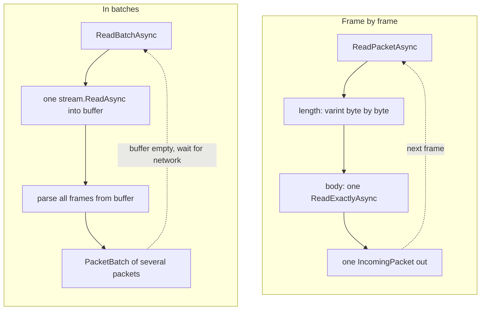

# Connection without a client

`MinecraftClient` holds one socket, one `MinecraftConnection` inside it,
and a `ReadPacketsAsync` loop that runs through all protocol phases in
order - the "Packet stream" page covers that path. Sometimes the full
path is not needed: some other code already opened the socket, and the
only thing needed is the frame protocol over an arbitrary `Stream`,
without phases or client connection options - a proxy tool, a test rig,
a hand-written game server. `MinecraftConnection` and
`StreamingConnection` give the same frame reading and writing as the
client, but without phase state and without the TCP connection wrapper.

## MinecraftConnection: frame by frame

`MinecraftConnection` builds directly on a `Stream`: the constructor
takes the stream and a `leaveOpen` flag, and opens or connects nothing
else. `ReadPacketAsync` reads exactly one frame and returns an
`IncomingPacket`. `WritePacketAsync` (two overloads: a packet with the
varint id already written as one memory block, or the id separate from
the body) writes one frame and flushes the stream itself - each call
goes to the socket right away, without waiting for any other packets.

`CompressionThreshold` switches compression the same way as in the
client: a new value takes effect from the next frame, in both
directions. `EnableEncryption` turns on AES/CFB8 for reading and writing
at once, and it can be called only once in the lifetime of a connection.
`IsEncrypted` shows whether encryption is on.

`MinecraftConnection` does not break silently. It holds `Completion` - a
task that completes on close - and `CloseReason`: the reason for
closing, or `null` for a clean end of stream or a switch to streaming
mode. `Abort` breaks the connection from any thread. `DisposeAsync`
stops the connection and returns the buffers to the pool. After that,
any call throws `ObjectDisposedException`.

## StreamingConnection: in batches

`StreamingConnection` is never created directly - only through
`MinecraftConnection.ToStreaming()`. The method passes the new object
the stream, the already-enabled cipher, and the current compression
threshold, and it strips the original `MinecraftConnection` of further
work: after the switch, any call on it besides `Abort` throws
`InvalidOperationException`. On a `StreamingConnection`, the cipher and
the compression threshold are fixed for the lifetime of the connection -
they cannot be changed here.

`ReadBatchAsync` reads not one frame but everything found in a single
call to the stream, and it returns a `PacketBatch` - a struct that
supports `foreach`. `Count == 0` together with `IsCompleted == true`
means the end of the stream. `ReadPacketsAsync` wraps `ReadBatchAsync` in
one `IAsyncEnumerable<IncomingPacket>`, but it ends differently than the
client version: here, a clean end of stream just exits the `await
foreach`, without an `EndOfStreamException`.

Writing works differently. `WritePacket` (three forms, all synchronous,
with no cancellation token: a ready frame as one block, id and body as a
block, or id and body scattered across a `ReadOnlySequence<byte>`)
places the frame in the send buffer and sends nothing to the socket.
Bytes go out only through `FlushAsync` - the whole accumulated buffer in
one call - or through `CompleteAsync`, which does the same and closes
the connection cleanly. `UnflushedBytes` shows how many bytes are framed
but not yet sent.

## Why batches are faster

Behind `MinecraftConnection`'s `ReadPacketAsync` stands
`PacketStreamReader`: it reads the frame length as a varint byte by
byte, each byte a separate `ReadExactlyAsync`, and the body is one more
call - at least two calls to the stream per frame. Behind
`StreamingConnection`'s `ReadBatchAsync` stands `BufferedPacketReader`:
one `stream.ReadAsync` into a shared pooled buffer, then parsing of
every frame already found in the bytes read. The implementation touches
the network again only when the buffer does not hold the next frame in
full - one system call can hand back a dozen packets at once.

Writing is symmetric. `WritePacketAsync` writes and flushes the stream
on every call - N packets mean N calls to the network. `WritePacket` on
a `StreamingConnection` is synchronous and works only with the in-memory
buffer, with no `await` and no trip to the socket. `FlushAsync` sends
the accumulated data with one `WriteAsync` and one `FlushAsync`, no
matter how many `WritePacket` calls came before it.



The price for speed is a wider data lifetime window: a batch stays whole
until the next `ReadBatchAsync`, not frame by frame.

## Limits and quirks

`IncomingPacket.Body` is a window into the transport buffer in both
cases ([Receive buffer](03-packet-stream.md)), but the boundary differs.
On `MinecraftConnection`, the body lives until the next
`ReadPacketAsync`, as everywhere else. On `StreamingConnection`, the
whole batch lives: the body of any packet goes stale as soon as the next
`ReadBatchAsync` starts, even if the previous batch was not fully
parsed. Data needed for longer is copied explicitly, as described in
"Packet stream".

Neither type survives concurrent reads: a second `ReadPacketAsync` (or
`ReadBatchAsync` on `StreamingConnection`) started on top of an
unfinished first one gets `InvalidOperationException` - the calling code
is holding two reads at once, not the transport hitting a race. On
`MinecraftConnection`, `CompressionThreshold` and `EnableEncryption` can
also change only between frames - a call in the middle of a read or
write throws the same exception. `StreamingConnection` does not offer
that choice at all: the cipher and the compression threshold are fixed
at the moment of `ToStreaming()`.

Writing into a `StreamingConnection` buffer does not mean sending:
`WritePacket` only frames bytes in memory until `FlushAsync` or
`CompleteAsync` is called. `DisposeAsync` without a preceding
`FlushAsync` silently drops whatever settled in the buffer.

## Example: sending through a queue

One thread puts packets into a `Channel<T>`, another task reads the
channel and writes them to a `StreamingConnection`, flushing the buffer
every thirty-two packets or when the channel runs empty - with no delay
if fewer packets arrived than the threshold:

```csharp
readonly record struct Outgoing(int Id, byte[] Body);

var channel = Channel.CreateUnbounded<Outgoing>();

async Task SenderAsync(StreamingConnection conn, CancellationToken token)
{
    var reader = channel.Reader;
    var sinceFlush = 0;

    while (await reader.WaitToReadAsync(token))
    {
        while (reader.TryRead(out var packet))
        {
            conn.WritePacket(packet.Id, packet.Body);
            if (++sinceFlush >= 32)
            {
                await conn.FlushAsync(token);
                sinceFlush = 0;
            }
        }

        if (sinceFlush > 0)
        {
            await conn.FlushAsync(token);
            sinceFlush = 0;
        }
    }
}
```

`WritePacket` never crosses an `await` here, so framing dozens of
packets between two `FlushAsync` calls costs no extra trip to the
network.

## Next

- [Packet stream](03-packet-stream.md) - the same protocol through the
  client
- [Frames](02-framing.md) - the format of one frame, with and without
  compression
- [Encryption and compression](05-encryption-and-compression.md) - what
  `CompressionThreshold` and `EnableEncryption` switch
- [Cancellation, errors, closing](06-cancellation.md) - the cancellation
  token, `Abort`, and `DisposeAsync` on both connection types
