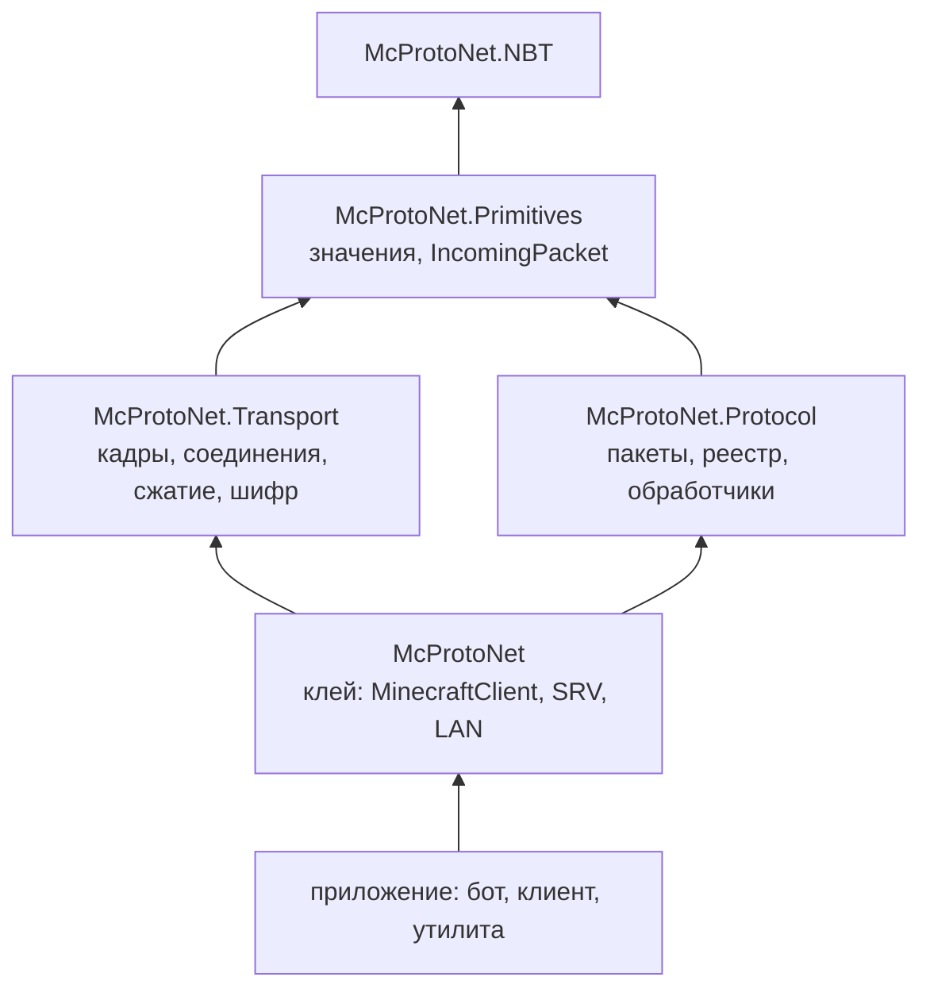

# Кто кого знает

Связи между слоями односторонние и короткие.

Стрелка читается как «ссылается на».

Транспорт и пакетный слой стоят рядом и друг о друге не знают. Оба опираются
на примитивы. Клей ссылается на оба, приложение - на клей.

## Зачем такая развязка

Транспорт остаётся полезным без сгенерированных пакетов. Прокси, снифферы,
свои эксперименты с протоколом - им нужны кадры, сжатие и шифр, а разбор
конкретных пакетов не нужен.

Пакетный слой, наоборот, работает без сети. Ему на вход дают `IncomingPacket`,
и откуда тот взялся - из сокета, из файла, из теста - неважно. Поэтому
пакеты и раскладки по версиям проверяются круговыми тестами, без сервера.

## Отсюда одна неочевидность

Типизированная отправка `SendAsync<T>` живёт в клее, а не рядом с пакетами.
Иначе пакетному слою пришлось бы увидеть транспорт, и развязка кончилась бы.

## Обработчик - не посетитель

В пакетном слое есть два способа разобрать входящий пакет: посетитель
`PacketFlow` (синхронный `Visit<T>`) и обработчик `ClientboundHandler` /
`ServerboundHandler` (асинхронный `On<Name>`, возвращает `ValueTask`).
Почему это разные пути, а не один поверх другого - в
[«Обработчиках и неизвестных пакетах»](../05-packets/04-handlers.md).
