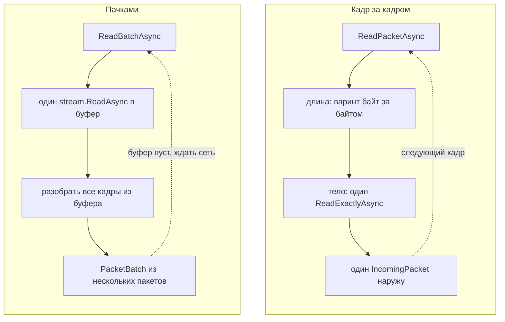

# Соединение без клиента

[`MinecraftClient`](../08-api-reference/McProtoNet/MinecraftClient.md) держит
один сокет, один
[`MinecraftConnection`](../08-api-reference/McProtoNet/Transport/MinecraftConnection.md)
внутри и цикл `ReadPacketsAsync`, идущий через все фазы протокола подряд - этому
пути посвящена страница «Поток пакетов». Иногда весь путь не нужен: сокет уже
открыт другим кодом, а нужен только протокол кадров поверх произвольного
`Stream`, без фаз и параметров подключения клиента - прокси-инструмент, тестовый
стенд, самописный игровой сервер. `MinecraftConnection` и
[`StreamingConnection`](../08-api-reference/McProtoNet/Transport/StreamingConnection.md)
дают то же чтение и запись кадров, что и клиент, но без состояния фаз и без
TCP-обвязки подключения.

## MinecraftConnection: кадр за кадром

`MinecraftConnection` строится прямо от `Stream`: конструктор берёт поток и флаг
`leaveOpen`, больше ничего не открывает и никуда не подключается.
`ReadPacketAsync` читает ровно один кадр и возвращает
[`IncomingPacket`](../08-api-reference/McProtoNet/Primitives/IncomingPacket.md).
`WritePacketAsync` (две перегрузки: пакет с уже записанным varint-id одним
куском памяти или id отдельно от тела) пишет один кадр и сам сбрасывает поток -
каждый вызов уходит на сокет сразу, не дожидаясь соседних пакетов.

`CompressionThreshold` переключает сжатие так же, как в клиенте: новое значение
действует с следующего кадра в обе стороны. `EnableEncryption` включает AES/CFB8
сразу для чтения и записи и может быть вызван только один раз за жизнь
соединения; `IsEncrypted` показывает, включён ли шифр.

Вместо тихого разрыва `MinecraftConnection` держит `Completion` - задачу,
завершающийся при закрытии, - и `CloseReason`: причину закрытия или `null` для
чистого конца потока либо перехода в потоковый режим. `Abort` рвёт соединение с
любого потока. `DisposeAsync` останавливает его и возвращает буферы в пул; после
него любой вызов бросает `ObjectDisposedException`.

## StreamingConnection: пачками

`StreamingConnection` не создаётся напрямую - только через
`MinecraftConnection.ToStreaming()`. Метод передаёт новому объекту поток, уже
включённый шифр и текущий порог сжатия и лишает исходный `MinecraftConnection`
дальнейшей работы: после перехода любой его вызов, кроме `Abort`, бросает
`InvalidOperationException`. На `StreamingConnection` шифр и порог сжатия
зафиксированы на всё время жизни соединения - сменить их здесь нельзя.

`ReadBatchAsync` читает не один кадр, а всё, что нашлось за одно обращение к
потоку, и возвращает
[`PacketBatch`](../08-api-reference/McProtoNet/Transport/Framing/PacketBatch.md)
- структуру, по которой можно пройти `foreach`. `Count == 0` вместе с
`IsCompleted == true` означает конец потока. `ReadPacketsAsync` оборачивает
`ReadBatchAsync` в один `IAsyncEnumerable<IncomingPacket>`, но заканчивается он
иначе, чем у клиента: чистый конец потока здесь просто выходит из `await
foreach`, без `EndOfStreamException`.

Запись устроена иначе. `WritePacket` (три формы, все синхронные, без токена
отмены: готовый кадр одним куском, id и тело куском, id и тело россыпью через
`ReadOnlySequence<byte>`) кладёт кадр в буфер отправки и ничего не шлёт на
сокет. Байты уходят только по `FlushAsync` - весь накопленный буфер одним
вызовом - или по `CompleteAsync`, который делает то же самое и закрывает
соединение чисто. `UnflushedBytes` показывает, сколько байт закадрировано, но
ещё не отправлено.

## Почему пачками быстрее

За `ReadPacketAsync` у `MinecraftConnection` стоит
[`PacketStreamReader`](../08-api-reference/McProtoNet/Transport/Framing/PacketStreamReader.md):
длину кадра он читает варинтом байт за байтом, каждый байт - отдельный
`ReadExactlyAsync`, а тело - ещё один: минимум два обращения к потоку на кадр.
За `ReadBatchAsync` у `StreamingConnection` стоит `BufferedPacketReader`: один
`stream.ReadAsync` в общий пул-буфер, а дальше разбор всех кадров, что уже
нашлись в прочитанных байтах. К сети реализация обращается заново, только когда
буфера не хватило на следующий кадр целиком - один системный вызов может отдать
сразу десяток пакетов.

Запись устроена симметрично. `WritePacketAsync` пишет и сбрасывает поток на
каждый вызов - N пакетов дают N обращений к сети. `WritePacket` на
`StreamingConnection` синхронный и работает только с буфером в памяти, без
`await` и без похода к сокету; `FlushAsync` отправляет накопленное одним
`WriteAsync` и одним `FlushAsync`, сколько бы вызовов `WritePacket` до этого ни
было.



Плата за скорость - шире окно жизни данных: пачка держится целиком до следующего
`ReadBatchAsync`, а не кадр за кадром.

## Ограничения и особенности

`IncomingPacket.Body` - окно в буфер транспорта в обоих случаях
([«Буфер приёма»](03-packet-stream.md)), но граница разная. У
`MinecraftConnection` тело живёт до следующего `ReadPacketAsync`, как и везде. У
`StreamingConnection` живёт вся пачка: тело любого пакета портится с началом
следующего `ReadBatchAsync`, даже если из прошлой пачки разобрали не все пакеты.
Данные, нужные дольше, копируют явно, как описано в «Потоке пакетов».

Ни один из двух типов не переживает параллельное чтение: второй
`ReadPacketAsync` (или `ReadBatchAsync` у `StreamingConnection`) поверх
незавершённого первого получает `InvalidOperationException` - это держит два
чтения разом вызывающий код, а не транспорт словил гонку. У
`MinecraftConnection` `CompressionThreshold` и `EnableEncryption` тоже можно
менять только между кадрами - вызов посреди чтения или записи бросает то же
исключение. `StreamingConnection` этого выбора не даёт вообще: шифр и порог
сжатия фиксируются в момент `ToStreaming()`.

Запись в буфер `StreamingConnection` не значит отправку: `WritePacket` только
кадрирует байты в памяти, пока не вызван `FlushAsync` или `CompleteAsync`.
`DisposeAsync` без предшествующего `FlushAsync` молча теряет то, что осело в
буфере.

## Пример: отправка через очередь

Один поток кладёт пакеты в `Channel<T>`, другая задача читает канал и пишет их в
`StreamingConnection`, сбрасывая буфер раз в тридцать два пакета или когда канал
опустел - без задержки, если пакетов пришло меньше порога:

```csharp
readonly record struct Outgoing(int Id, byte[] Body);

var channel = Channel.CreateUnbounded<Outgoing>();

async Task SenderAsync(StreamingConnection conn, CancellationToken token)
{
    var reader = channel.Reader;
    var sinceFlush = 0;

    while (await reader.WaitToReadAsync(token))
    {
        while (reader.TryRead(out var packet))
        {
            conn.WritePacket(packet.Id, packet.Body);
            if (++sinceFlush >= 32)
            {
                await conn.FlushAsync(token);
                sinceFlush = 0;
            }
        }

        if (sinceFlush > 0)
        {
            await conn.FlushAsync(token);
            sinceFlush = 0;
        }
    }
}
```

`WritePacket` здесь не пересекает `await` ни разу, поэтому кадрирование десятков
пакетов между двумя `FlushAsync` не стоит ни одного лишнего обращения к сети.

## Дальше

- [Поток пакетов](03-packet-stream.md) - тот же протокол через клиента
- [Кадры](02-framing.md) - формат одного кадра, со сжатием и без
- [Сжатие и шифрование](05-encryption-and-compression.md) - что переключают
  `CompressionThreshold` и `EnableEncryption`
- [Отмена и закрытие](06-cancellation.md) - токен отмены, `Abort` и
  `DisposeAsync` на обоих типах соединения
