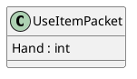
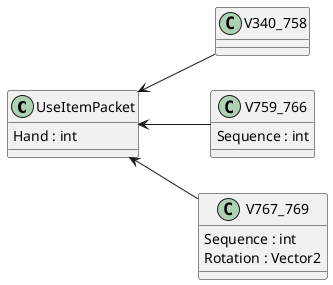

Вот переработанный и сглаженный текст:

---

# Мультиверсия

В этом разделе рассматриваются архитектурные принципы, на которых основана поддержка мультиверсии в **McProtoNet.Protocol**.

## Какие версии поддерживаются?

На данный момент **McProtoNet.Protocol** поддерживает версии Minecraft от **%min_minecraft_version%** ( **%min_minecraft_protocolversion%**) до **%max_minecraft_version%** ( **%max_minecraft_protocolversion%**).

## Главная идея

Для того чтобы лучше понять, как устроена мультиверсия, рассмотрим пакет `UseItem`, который претерпел несколько изменений в разных версиях протокола:

<tabs>
<tab title="340-758">
<table>
    <tr>
        <td>Имя</td>
        <td>Тип</td>
    </tr>
    <tr>
        <td>Hand</td>
        <td>VarInt</td>
    </tr>
</table>
</tab>
<tab title="759-766">
<table>
    <tr>
        <td>Имя</td>
        <td>Тип</td>
    </tr>
    <tr>
        <td>Hand</td>
        <td>VarInt</td>
    </tr>
    <tr>
        <td>Sequence</td>
        <td>VarInt</td>
    </tr>
</table>
</tab>
<tab title="767-769">
<table>
    <tr>
        <td>Имя</td>
        <td>Тип</td>
    </tr>
    <tr>
        <td>Hand</td>
        <td>VarInt</td>
    </tr>
    <tr>
        <td>Sequence</td>
        <td>VarInt</td>
    </tr>
    <tr>
        <td>Rotation</td>
        <td>Vector2</td>
    </tr>
</table>
</tab>
</tabs>

Как видно, общее поле для всех версий — это `Hand`, поэтому для этого пакета был создан общий класс `UseItemPacket`, который содержит только одно поле — `Hand: int`.



### Сериализация пакета на разных версиях

На других версиях пакет может включать дополнительные поля, которые необходимо записать в сетевой поток, иначе сервер не сможет корректно прочитать пакет. Для решения этой проблемы используются значения по умолчанию для общих полей. Например, для числовых значений это будет 0, для строк — пустая строка, а для массивов — пустой массив.

В контексте пакета `UseItem` на версиях 767-769 в поле `Sequence` будет записан 0, а в поле `Rotation` — два нуля (так как `Vector2` состоит из двух числовых значений).

## Конкретные версии

Использование общих полей — удобное решение, но в некоторых случаях может возникнуть необходимость отправить пакет с конкретными значениями для определённой версии. Иногда пакеты меняются настолько сильно, что общие поля просто не подходят. Конечно, такие поля могут быть, но важно понимать, что большая часть пакетов генерируется автоматически, и порой бывает сложно найти что-то общее между версиями пакета. Даже человеку это может показаться трудным, а скрипту гораздо сложнее.

Для решения этой проблемы используются вложенные классы, в которых определены недостающие поля для каждой версии. Эти классы называются `V<min_version>_<max_version>`, и они наследуются от базового класса. Вот пример:



## Серверные пакеты

Принципы архитектуры серверных пакетов схожи с клиентскими, но есть одно отличие: основной класс пакета является абстрактным и содержит общие поля. При чтении пакета от сервера создаётся конкретный экземпляр вложенного класса на основе идентификатора и версии протокола.

## Примеры кода

Теперь рассмотрим примеры отправки и получения пакетов.

### Отправка пакета

Предположим, наша задача — отправить пакет `BlockPlace`.

Если нас не интересуют детали для конкретных версий, мы можем отправить пакет следующим образом:

```C#
using McProtoNet.Protocol.Packets.Play.Serverbound;
using McProtoNet.Protocol;

Minecraft client = new();
// initialize ...

var packet = new BlockPlacePacket
{
    CursorX = 1.0f,
    CursorY = 2.0f,
    CursorZ = 3.0f,
    Direction = 4,
    Hand = 5,
    Location = new Position(6, 7, 8)
};
await client.SendPacket(packet);
```

Но если нам нужно контролировать поле `InsideBlocks` на версии протокола **500**, тогда необходимо использовать вложенный класс `V477_758`:

```C#
using McProtoNet.Protocol.Packets.Play.Serverbound;
using McProtoNet.Protocol;

Minecraft client = new();
// initialize ...

var packet = new BlockPlacePacket.V477_758
{
    CursorX = 1.0f,
    CursorY = 2.0f,
    CursorZ = 3.0f,
    Direction = 4,
    Hand = 5,
    Location = new Position(6, 7, 8)
};
await client.SendPacket(packet);
```

Однако возникает проблема: если клиент подключён на версии протокола ниже 477 или выше 758, метод `SendPacket` сгенерирует исключение `ProtocolNotSupportException`, так как проверяется поддерживаемая версия протокола с помощью метода `IsSupportedVersion` у пакета.

Чтобы избежать этой ошибки, можно использовать метод расширения `TrySend`:

```C#
if (client.TrySend<BlockPlacePacket.V477_758>(out var sender))
{
    sender.Packet.CursorX = 1.0f;
    sender.Packet.CursorY = 2.0f;
    sender.Packet.CursorZ = 3.0f;
    sender.Packet.Direction = 4;
    sender.Packet.Hand = 5;
    sender.Packet.Location = new Position(6, 7, 8);
    sender.Packet.InsideBlock = true;

    await sender.Send();
}
```

### Обработка серверных пакетов

Один из часто используемых пакетов от сервера в Minecraft — это пакет `Position`, который отвечает за позицию игрока в игровом мире. Рассмотрим, как в **McProtoNet.Protocol** осуществляется обработка серверных пакетов.

Обработка серверных пакетов проста — нужно лишь проверить тип прочитанного пакета:

```C#
using McProtoNet.Protocol;
using McProtoNet.Protocol.Packets.Play.Clientbound;

MinecraftClient client = new(); // Initialize ...

await foreach (IServerPacket packet in client.OnAllPackets(PacketState.Play))
{
    if (packet is PositionPacket position)
    {
        // Работа с пакетом position
    }
}
```

Если необходимо обработать конкретные поля на определённых версиях, например, поле `DismountVehicle` на версиях от **755** до **761**, это делается следующим образом:

```C#
await foreach (IServerPacket packet in client.OnAllPackets(PacketState.Play))
{
    if (packet is PositionPacket.V755_761 position)
    {
        Console.WriteLine(position.DismountVehicle);
    }
}
```
